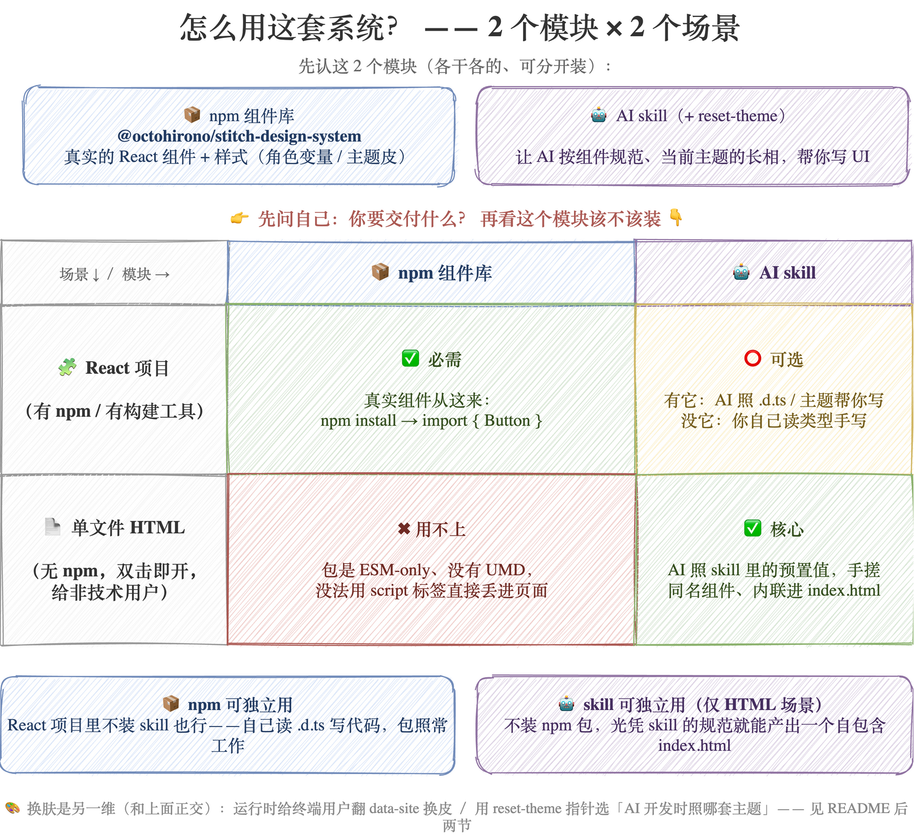

# stitch-design-system

一套 React + TypeScript 组件库，AI 是一等公民：同一套组件、一套 `--stitch-*` 角色契约，构建时切换成不同网站的风格（多站换肤）。

装上它，你得到两样东西：

- **一个 npm 组件库** `@octohirono/stitch-design-system`——在自己的 React 项目里 import 组件、import 一次样式即用。
- **一套 AI skill**——让 AI 照这套组件库的规范、以你选定的主题长相搭 UI。

一次只有一套主题的「默认皮」烤进包里；想让终端用户自己选主题，可按需 opt-in 多套 `themes/*`（[灵活切换主题](#用-npm-包灵活切换主题)）。

- **深入用法**（装好 skill 后 AI 读的规范、两种使用场景、组件目录）→ [skill 说明](./skills/stitch-design-system/README.md)
- **参与维护 / 贡献**（加组件、加主题、发布、命令速查）→ [维护 runbook](./docs/contributing/maintainer-runbook.md)
- **仓库规则 / 权威顺序 / 硬红线** → [AGENTS.md](./AGENTS.md)；**术语**（角色契约 / 插座 / adapter…）→ [CONTEXT.md](./CONTEXT.md)

---

## 安装

**装 skill / 插件**（让 AI 按这套设计系统写 UI），用通用 CLI `vercel-labs/skills`（交互选 skill + 选目标 agent）：

```bash
npx skills add HironoOcto/stitch-design-system
```

Claude Code 用户另有一条**原生路径**（仓库根的 `.claude-plugin/`）：

```bash
claude plugins install stitch-design-system@HironoOcto/stitch-design-system
```

两条路径并存、装法决策见 [ADR 0008](./docs/adr/0008-distribution-and-package-name.md)；更完整的安装 / 更新 / 卸载说明见 [skill 说明 · 安装](./skills/stitch-design-system/README.md#安装)。

**装组件库**（React 项目里用组件）：

```bash
npm install @octohirono/stitch-design-system
```

---

## 在项目里用组件

先看这张全景——两个模块（npm 组件库 / AI skill）在两种场景（React 项目 / 单文件 HTML）里各是什么角色：**npm 包可独立用**，**skill 也可独立用（仅 HTML 场景）**。



> 源文件 [docs/assets/how-to-use.drawio](./docs/assets/how-to-use.drawio) 可在 draw.io 里编辑。

组件**只读角色变量** `var(--stitch-*)`，长相由当前主题灌值——你只管用组件、import 一次样式，换皮由主题层负责。装好 skill 后 AI 会先读 `SKILL.md`，再按两种场景之一展开写法：

- **React 项目**——装包、入口 import 一次 `@octohirono/stitch-design-system/style`、以 `.d.ts` 为准写代码。详见 [skill · React 项目场景](./skills/stitch-design-system/references/react-project.md)。
- **单文件 HTML**——无 npm、React 走 CDN，内联手搓与真实导出同名的组件。详见 [skill · 单文件 HTML 场景](./skills/stitch-design-system/references/standalone-html.md)。

组件目录（族 → 成员）与逐族 props 参考见 [skill 说明 · 组件](./skills/stitch-design-system/README.md#组件)。

---

## 用 npm 包灵活切换主题

包默认只带一套「默认皮」（发布时烤进 `dist/style.css` 的那套）。使用方 app **零重发布**就想自己选主题、甚至运行时切，用包的 `themes/*` 导出（原理见 [ADR 0009](./docs/adr/0009-themes-preview-export.md)）。

包里已为每个可发布站预置了一份 `themes/<site>.css`——里面**只装这个站要覆盖的那批值**，全部收在 `[data-site="<site>"]` 选择器下（各站共用、不随主题变的那部分留在 `style.css` 的 `:root`，不重复搬）。所以给 `<html>` 挂上 `data-site="<site>"`，浏览器就用这个站的值盖掉默认皮、整站换肤。你按需引入要用的站即可（有哪些站取决于该版本[可发布站](./scripts/lib/publishable-sites.mjs)集合）：

```ts
// app 唯一入口（main.tsx / index.tsx）写一次，全局生效——业务组件里不用再碰
// style 必装；themes/* 引入你要提供给用户选的那几套（只是备好料，此刻还没换）
import '@octohirono/stitch-design-system/style';
import '@octohirono/stitch-design-system/themes/seline';
import '@octohirono/stitch-design-system/themes/steep';
```

```ts
// data-site 挂在 <html> 上、全站唯一开关：翻一次即整站换肤，集中写一处即可
// （比如主题选择器的 onChange，或启动时读一次用户偏好），不用每个组件各写一遍
document.documentElement.dataset.site = 'steep'; // 或 'seline'
document.documentElement.removeAttribute('data-site'); // 回默认皮
```

> **零配置默认**：只 `import '.../style'`、不引 `themes/*`、不设 `data-site` 的消费方，拿到的就是 `dist/style.css` 里烤死的默认皮（[ADR 0007](./docs/adr/0007-active-site-single-switch.md)）——不想管多主题的 app 什么都不用做。想让用户灵活选主题，再按上面 opt-in 引入 `themes/*`：一站一份、只搬每站值到 `[data-site]`，不引就不存在、零膨胀。

---

## 用 reset-theme 切换开发主题

上一节的 `themes/*` 是**运行时**给终端用户翻 `data-site` 换皮；这一节换的是另一回事——**你（使用方）开发时，让 AI 照哪套主题写 UI**。发这套 skill 的插件里除了 `stitch-design-system`，还并列一条 [`reset-theme`](./skills/reset-theme/SKILL.md) skill 专管这件事（同插件分发，便于彼此定位、一致更新）。

它做的事极小、也极稳：

1. **列可发布站**：从并列的 `stitch-design-system` skill 附带的 `references/theme-presets/*` **动态取**当前可选主题（零写死站名——跟 [`listPublishableSites`](./scripts/lib/publishable-sites.mjs) 判据同一集合）。
2. **挑一套**：由你选，AI 不替你定、也不会给出列表外的名字。
3. **只写项目指针**：把你选的站名写进**你自己项目**的 `.agent/stitch.theme.json` 的 `activeSite`（其余键原样保留；`.agent/` 是通用 agent 目录，也是本插件安装所在，故指针随之落这里——刻意区别于本仓库开发用的根 `stitch.config.json`）。**只碰这一个文件**——不改任何已装插件的内脏，所以升级插件不丢选择；幂等（再选同一套 = 同结果）；**按项目隔离**（指针落在各自项目的 `.agent/` 里，所以你手上每个项目都能独立选自己的主题，互不影响）。

选定后，`stitch-design-system` skill 就**读时解析**这枚指针决定照哪套主题写 UI（[ADR 0010](./docs/adr/0010-consume-time-theme-choice.md)），无指针则回落到发布默认（= npm 包默认皮）。

> **两边对齐，不漂移**：上一节的**预览**认 `data-site="<站>"`，这一节的**开发**认指针 `activeSite="<站>"`——**同一个站名**即两边说的是同一套皮。给终端用户预览的那套，和 AI 开发时照的那套，从结构上锁成一致。
